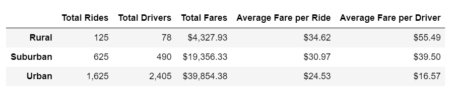
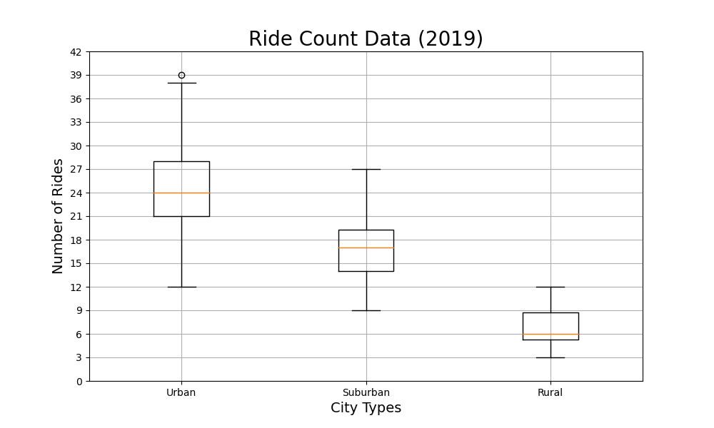
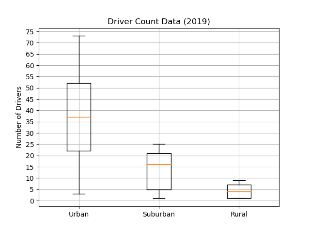
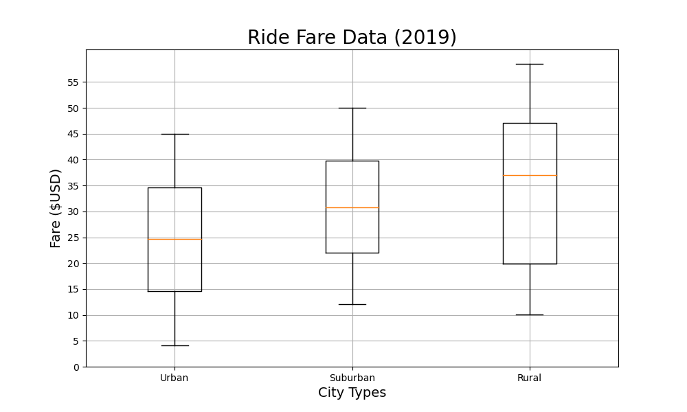
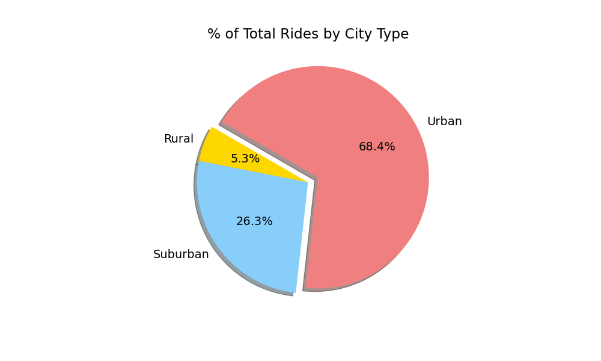
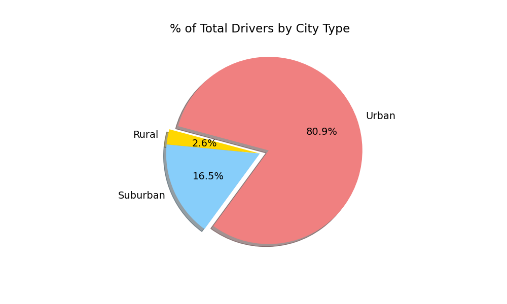
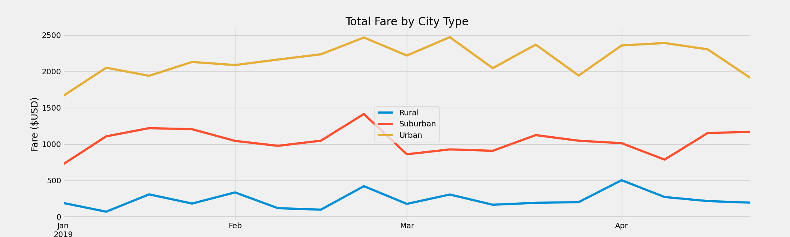

# PyBer Analysis
## Overview of Project
PyBer is a ridesharing app company. Our objective is to help PyBer improve access to ridesharing services and determine affordability for underserved neighborhoods.

We will be using Pandas libraries, Jupyter Notebook, and Matplolib to create a variety of charts that showcase the relationship between the type of city and the number of drivers and riders, as well as the percentage of total fares, riders, and drivers by type of city. 

## Preparing the Data
First, we generated a ride-sharing DataFrame by city type using .groupby(), count(), and sum() functions. Then, we created graphs for each data point.

#### Total Rides for Each City Type

#### Total Drivers for Each City Type

#### Total Fares for Each City Type

#### Average Fare per Rides and Drivers

#### Total Fare by City Type

### Summary
The charts above depict there are major differences between rural and urban areas. The total rides for urban areas are 1,625 whereas the total rides in rural areas are 125. The average fare per ride is higher in rural areas than urban areas. This allows drivers to gain more money per ride in the rural areas, averaging $55.49 per ride. PyBer is gaining most of their profit from urban cities with a total fare of $39,854.38. Total fares by city type will show that the fare prices spike in the last weeks of February and March. 

### Recommendations
-	Decrease the fare in rural areas to attract more riders.
-	Increase the fares in urban areas. Since there is more demand in this area, you can increase the price of supply. This will also allow the drivers to gain more profit on their rides.
-	We need further analysis on rural areas. Is there lower demand because of a shortage of drivers or because larger distance? Based on the results, PyBer can hire more drivers for the rural areas and lowering the cost will encourage riders to start using PyBer. 
